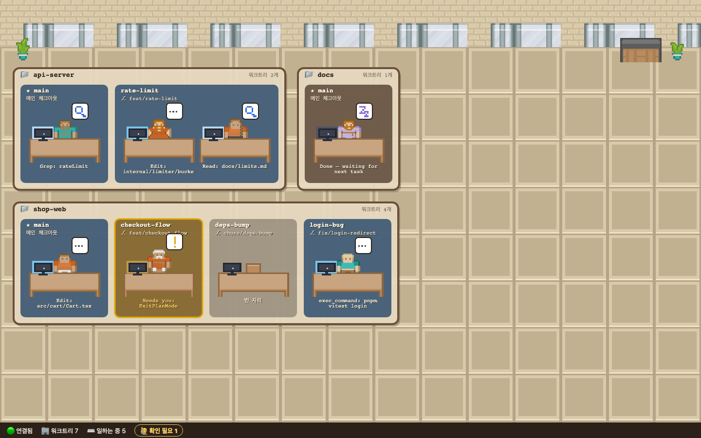

# Office Desks

[Orca](https://www.onorca.dev/) 위에 얹는 **픽셀아트 사무실**입니다. Orca에서 돌고 있는 코딩 에이전트(Claude Code, Codex 등)를
책상에 앉은 캐릭터로 보여주고, 캐릭터를 눌러 대화를 읽고 바로 지시를 보낼 수 있습니다.
터미널·워크트리 관리는 Orca가 그대로 하고, Office Desks는 그 위의 "현황판 + 조작 패널" 역할만 합니다.



- **프로젝트 = 방, 워크트리 = 팀 자리, 에이전트 = 캐릭터.** 캐릭터의 움직임과 말풍선이 지금 하는 일을 보여줍니다.
- **전체 대화 보기**: Markdown 렌더링, 스크린샷 포함, 작업 중 보낸 추가 메시지, 서브에이전트 대화까지.
- **바로 지시 보내기**: Enter 전송, 이미지 붙여넣기, `/` 명령어·스킬 자동완성.
- **메뉴 조작**: `/usage`, `/config`, 권한 확인처럼 터미널에 뜬 메뉴를 웹에서 키보드로 그대로 조작.


---

## 요구 사항

| | 필요 조건 |
| --- | --- |
| Orca | 설치 후 **실행 중**이어야 합니다. Orca CLI가 터미널에서 실행돼야 합니다 (아래 OS별 확인 명령). |
| Node.js | **22 이상** (`node -v`로 확인) |
| Git | 저장소를 받기 위해 필요 |
| 브라우저 | 최신 Chrome / Edge / Safari / Firefox |
| (선택) 대화 기록 | Orca **Settings → Agent Session History**가 켜져 있어야 대화가 보입니다. 꺼져 있으면 캐릭터와 상태만 보입니다. |

---

## 설치와 실행

### macOS

```bash
# 1) Node.js 22+ (없다면)
brew install node            # 또는 https://nodejs.org 에서 LTS 설치

# 2) Orca CLI 확인 — Orca 앱이 켜져 있어야 합니다
orca status --json           # "ok": true 가 나오면 준비 완료

# 3) 받아서 실행
git clone https://github.com/Jang-seungminn/office-desks.git
cd office-desks
npm install
npm start
```

브라우저에서 **http://127.0.0.1:4317** 을 엽니다. Orca 안의 브라우저 탭에서 열어도 됩니다.

### Windows (PowerShell)

```powershell
# 1) Node.js 22+ (없다면)
winget install OpenJS.NodeJS.LTS

# 2) Orca CLI 확인 — Orca 앱이 켜져 있어야 합니다
orca status --json
where.exe orca               # 어떤 파일이 실행되는지 확인

# 3) 받아서 실행
git clone https://github.com/Jang-seungminn/office-desks.git
cd office-desks
npm install
npm start
```

브라우저에서 **http://127.0.0.1:4317** 을 엽니다.

> **Windows 참고**: `where.exe orca` 결과에 `orca.exe`가 있으면 그대로 됩니다.
> `orca.cmd`만 있다면 보안상 `" % & | < > ^ !` 문자나 여러 줄 메시지는 보낼 수 없습니다(cmd.exe 명령 주입 방지).
> 이 경우 Orca 설치 폴더의 실제 실행 파일을 지정하세요.
>
> ```powershell
> $env:ORCA_CLI_COMMAND = "C:\경로\orca.exe"; npm start
> ```

### Linux

```bash
# 1) Node.js 22+ (배포판 패키지나 nvm 등으로)
node -v

# 2) Orca CLI 확인 — Linux에서는 이름이 orca-ide 입니다
#    (그냥 orca 는 GNOME 화면 낭독기라서 실행하지 마세요)
orca-ide status --json

# 3) 받아서 실행
git clone https://github.com/Jang-seungminn/office-desks.git
cd office-desks
npm install
npm start
```

Orca가 관리하는 WSL 세션처럼 CLI 이름이 다르면 `ORCA_CLI_COMMAND`로 지정하세요.

### Orca 없이 먼저 구경하기

```bash
npm install
npm run demo        # 가짜 데이터(프로젝트 3개, 워크트리 7개, 상태가 8초마다 바뀜)
```

---

## 사용법

| 하고 싶은 것 | 방법 |
| --- | --- |
| 에이전트 대화 보기 | 캐릭터(책상) 클릭 → 오른쪽 패널의 **💬 대화** |
| 지시 보내기 | 패널 아래 입력창에 쓰고 **Enter** (줄바꿈은 Shift+Enter) |
| 이미지 보내기 | 입력창에 붙여넣기(⌘/Ctrl+V), 끌어다 놓기, 또는 🖼️ 버튼 |
| 명령어·스킬 | 입력창에 `/` → ↑↓ 이동, Tab/Enter 선택 |
| 메뉴·권한 확인 조작 | **🖥️ 터미널** 탭 화면을 클릭하고 키보드로 조작 (↑↓, Enter, Esc, 글자) |
| 서브에이전트 대화 | 대화 속 🤖 카드 클릭 |
| 기다리는 에이전트 찾기 | 아래 상태바의 **🙋 확인 필요 N** 클릭 |
| Orca에서 해당 터미널 열기 | 패널의 **Orca에서 열기** |

### 캐릭터 읽는 법

| 모습 | 의미 |
| --- | --- |
| 빠르게 들썩임 + 밝은 모니터 | 코드 작성·생각 중 |
| 좌우로 흔들림 + 🔎 | 파일 읽기·검색 |
| 천천히 들썩임 + `>_` | 셸 명령 실행 |
| 반쯤 일어섬 + 노란 `!` + 노란 테두리 | 사람 확인 필요 (권한, 플랜 승인 등) |
| `z` 말풍선 | 할 일 끝, 다음 지시 대기 |
| 책상 옆 작은 초록 인턴 | 서브에이전트가 일하는 중 |

셔츠 색은 에이전트 종류입니다: 주황 = Claude, 청록 = Codex, 연보라 = Gemini, 초록 = 기타.
방 이름표의 ★ 는 메인 체크아웃, `⎇` 는 브랜치, `↳` 는 Orca에서 분기된 부모 워크트리입니다.

### 알아둘 점

- 메뉴(`/usage`, `/config`, 권한 확인)가 열린 동안 보낸 메시지는 에이전트에게 전달되지 않습니다.
  Office Desks가 이를 감지해서 전송을 막고 터미널 탭으로 넘겨줍니다. 입력한 내용은 그대로 남습니다.
- 붙여넣은 이미지는 사용자 전용 임시 폴더에 저장되고 경로가 메시지 끝에 붙어 전달됩니다(24시간 뒤 자동 삭제).
  에이전트가 그 파일을 열 때 권한을 물을 수 있습니다.

---

## 설정

| 환경 변수 | 기본값 | 설명 |
| --- | --- | --- |
| `OFFICE_DESKS_PORT` | `4317` | 브리지 포트 |
| `ORCA_CLI_COMMAND` | macOS/Windows `orca`, Linux `orca-ide` | Orca CLI 실행 파일 이름 또는 경로 |

## 문제 해결

| 증상 | 확인할 것 |
| --- | --- |
| 하단에 `🔴 브리지 끊김` | `npm start` 터미널이 살아 있는지, 포트를 다른 프로그램이 쓰고 있지 않은지 |
| `⚠️ Orca 오류` | Orca 앱이 켜져 있는지, `orca status --json`이 되는지 (Linux는 `orca-ide`) |
| 캐릭터는 보이는데 대화가 안 보임 | Orca **Settings → Agent Session History** 켜기. 막 시작한 세션은 인덱싱까지 몇 초 걸립니다 |
| 메시지를 보냈는데 반응이 없음 | 🖥️ 터미널 탭에서 메뉴가 열려 있지 않은지 확인 |
| Windows에서 특정 문자를 못 보냄 | 위 Windows 참고의 `ORCA_CLI_COMMAND` 설정 |

---

## 개발

```bash
npm run dev         # 브리지 + Vite(HMR) → http://localhost:5173
npm test            # 단위 테스트 (vitest)
npm run typecheck
```

- `bridge/` — Node 서버. `orca worktree ps` / `orca terminal list`를 1.5초마다 읽어 바뀐 것만 WebSocket으로 보냅니다.
  `orca search`(Orca의 세션 인덱스)로 대화 파일을 찾아 Claude Code / Codex JSONL을 파싱합니다.
- `web/` — Vite + Phaser 3 사무실과 DOM 패널. 쓰는 타일은 모두 `web/src/assets.ts` 한 곳에 있어 다른 에셋 팩으로 바꾸기 쉽습니다.

## 보안

브리지는 셸 권한이 있는 에이전트의 터미널에 입력을 보낼 수 있으므로 다음을 지킵니다.

- `127.0.0.1`에만 바인딩합니다. Host 검사로 DNS rebinding을 막고, Origin·`Sec-Fetch-Site`·`Sec-Fetch-Dest` 검사로 다른 사이트나 iframe에서 오는 요청을 막습니다.
- 모든 응답에 `X-Frame-Options: DENY`와 엄격한 CSP(`frame-ancestors 'none'`, 원격 이미지·스크립트 차단)를 붙입니다.
- 상태를 바꾸는 API는 `POST` + `application/json`만 받고, 지금 사무실에 있는 터미널에만 보낼 수 있습니다. 키 입력은 허용 목록에 있는 것만 받습니다.
- Orca CLI는 셸 없이 인자 배열로 실행하고, 사용자 값은 항상 `--flag=value` 형태로 넘깁니다.
- 대화 기록은 신뢰하지 않는 입력으로 다룹니다. DOMPurify로 정화하고 `style`/`class`/`id` 속성과 원격 이미지를 제거합니다.
- 로컬 이미지는 해당 대화에 Markdown 링크로 나온 경로이고 실제 이미지 파일(심볼릭 링크 해석, 매직 바이트 확인)일 때만 보여줍니다.

취약점을 발견하면 공개 이슈 대신 GitHub의 **private security advisory**로 알려주세요.

## 크레딧과 라이선스

- 코드: [MIT](LICENSE)
- 픽셀아트: [Kenney](https://kenney.nl) — Roguelike Indoors, Roguelike Characters, Roguelike Modern City (CC0).
  `web/public/assets/kenney/LICENSE.txt` 참고. 모니터 뒷면과 상태 아이콘은 `web/src/sprites.ts`에서 코드로 그립니다.
- Office Desks는 Orca와 무관한 개인 프로젝트입니다.
