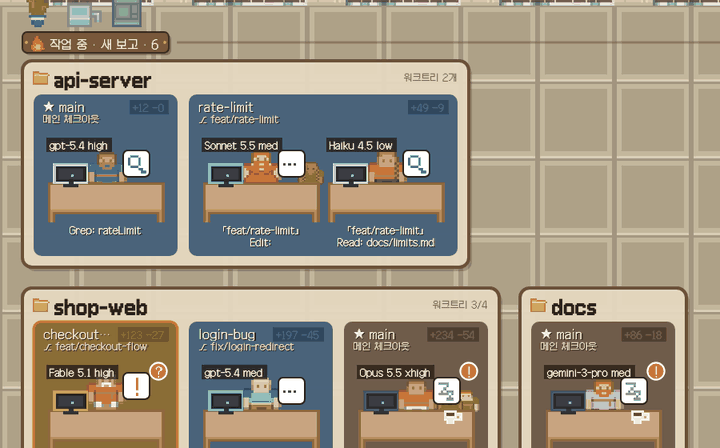
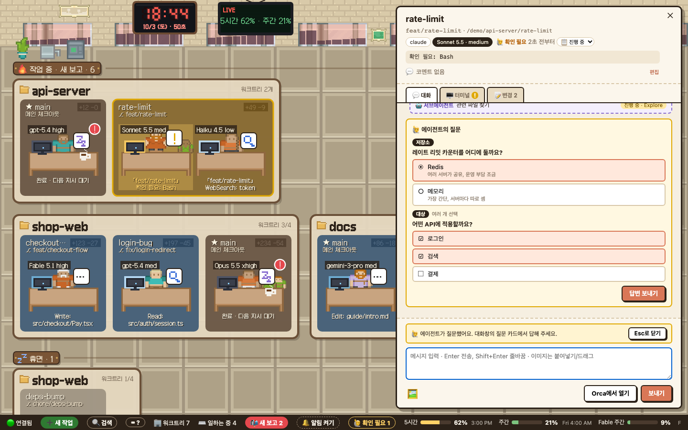

# Office Desks

[Orca](https://www.onorca.dev/) 위에 얹는 **픽셀아트 사무실**입니다. Orca에서 돌고 있는 코딩 에이전트(Claude Code, Codex 등)를
책상에 앉은 캐릭터로 보여주고, 캐릭터를 눌러 대화를 읽고 바로 지시를 보낼 수 있습니다.
터미널·워크트리 관리는 Orca가 그대로 하고, Office Desks는 그 위의 "현황판 + 조작 패널" 역할만 합니다.



- **프로젝트 = 방, 워크트리 = 팀 자리, 에이전트 = 캐릭터.** 작업 중 / 대기 / 휴면 층으로 나뉘고 최신이 왼쪽입니다.
- **전체 대화 보기**: Markdown, 스크린샷, 작업 중 보낸 추가 메시지, 대기열, 서브에이전트 대화까지.
- **바로 지시 보내기**: Enter 전송, 이미지 붙여넣기, `/` 명령어·스킬 자동완성, 중단·지금 보내기·대기 취소.
- **질문 카드**: 에이전트가 질문(AskUserQuestion)하면 대화창에 카드로 뜨고, 선택지를 눌러 바로 답합니다.
- **메뉴 조작**: `/usage`, `/config`, 권한 확인처럼 터미널에 뜬 메뉴를 웹에서 키보드로 그대로 조작.
- **변경사항**: 워크트리별 커밋 전 변경(+/−)과 PR 배지, 파일별 diff.
- **새 작업**: 웹에서 새 워크트리+에이전트를 만들거나 기존 워크트리에 에이전트 추가, Orca 보드 상태·코멘트 편집.
- **알림과 검색**: 끝난 에이전트 배지·데스크톱 알림, 모든 대화 검색(`Ctrl/⌘+K`).
- **사용량과 모델**: 하단에 5시간·주간·Fable 주간 사용량(Orca와 같은 값), 책상마다 모델과 effort.
- **사무실 꾸밈**: PC 시간 따라 바뀌는 창밖(밤엔 별과 야경), LED 시계, 현황 TV, 라운지.



---

## 요구 사항

| | 필요 조건 |
| --- | --- |
| Orca (선택) | Orca 백엔드를 쓸 때만 필요합니다. 설치 후 **실행 중**이어야 하고 Orca CLI가 터미널에서 실행돼야 합니다 (아래 OS별 확인 명령). Orca가 없으면 native 백엔드로 동작합니다. |
| Node.js | **22 이상** (`node -v`로 확인) |
| Git | 저장소를 받기 위해 필요 |
| 브라우저 | 최신 Chrome / Edge / Safari / Firefox |
| (선택) 대화 기록 | Orca **Settings → Agent Session History**가 켜져 있어야 대화가 보입니다. 꺼져 있으면 캐릭터와 상태만 보입니다. |

---

## 설치와 실행

> npm에 배포된 뒤에는 저장소를 받지 않고 한 줄로 실행할 수 있습니다: `npx office-desks` (`--demo`, `--port 4317`, `--help`).
> 아래는 소스에서 실행하는 방법입니다.

### macOS

```bash
# 1) Node.js 22+ (없다면)
brew install node            # 또는 https://nodejs.org 에서 LTS 설치

# 2) Orca CLI 확인 — Orca 앱이 켜져 있어야 합니다
orca status --json           # "ok": true 가 나오면 준비 완료

# 3) 받아서 실행
git clone https://github.com/Jang-seungminn/office-desks.git
cd office-desks
npm install
npm start
```

브라우저에서 **http://127.0.0.1:4317** 을 엽니다. Orca 안의 브라우저 탭에서 열어도 됩니다.

### Windows (PowerShell)

```powershell
# 1) Node.js 22+ (없다면)
winget install OpenJS.NodeJS.LTS

# 2) Orca CLI 확인 — Orca 앱이 켜져 있어야 합니다
orca status --json
where.exe orca               # 어떤 파일이 실행되는지 확인

# 3) 받아서 실행
git clone https://github.com/Jang-seungminn/office-desks.git
cd office-desks
npm install
npm start
```

브라우저에서 **http://127.0.0.1:4317** 을 엽니다.

> **Windows 참고**: `where.exe orca` 결과에 `orca.exe`가 있으면 그대로 됩니다.
> `orca.cmd`만 있다면 보안상 `" % & | < > ^ !` 문자나 여러 줄 메시지는 보낼 수 없습니다(cmd.exe 명령 주입 방지).
> 이 경우 Orca 설치 폴더의 실제 실행 파일을 지정하세요.
>
> ```powershell
> $env:ORCA_CLI_COMMAND = "C:\경로\orca.exe"; npm start
> ```

### Linux

```bash
# 1) Node.js 22+ (배포판 패키지나 nvm 등으로)
node -v

# 2) Orca CLI 확인 — Linux에서는 이름이 orca-ide 입니다
#    (그냥 orca 는 GNOME 화면 낭독기라서 실행하지 마세요)
orca-ide status --json

# 3) 받아서 실행
git clone https://github.com/Jang-seungminn/office-desks.git
cd office-desks
npm install
npm start
```

Orca가 관리하는 WSL 세션처럼 CLI 이름이 다르면 `ORCA_CLI_COMMAND`로 지정하세요.

### Orca 없이 먼저 구경하기

```bash
npm install
npm run demo        # 가짜 데이터(프로젝트 3개, 워크트리 7개, 상태가 8초마다 바뀜)
```

---

## Orca 없이 쓰기 (native)

Orca가 실행 중이 아니면 Office Desks가 직접 에이전트를 띄웁니다 (`--backend native`로 강제할 수도 있어요).

1. `npm start` (또는 `npx office-desks`) → 브라우저에서 **➕ 새 작업 → 프로젝트 추가**에 git 저장소 경로를 넣습니다.
2. 새 작업을 만들면 `~/.office-desks/worktrees/<프로젝트>/<이름>`에 워크트리가 생기고 그 안에서 에이전트가 뜹니다.
3. 처음 여는 폴더면 Claude가 "이 폴더를 신뢰하나요?"를 물어요. 캐릭터를 눌러 **터미널** 탭에서 `Yes, I trust this folder`를 고르면, 적어 둔 첫 지시가 그때 전달됩니다.

- 에이전트는 Office Desks 프로세스 안에서 돕니다. 서버를 끄면 에이전트도 함께 종료됩니다.
- 상태는 Claude Code 훅으로 받습니다(사용자 설정은 건드리지 않고 `--settings`로만 추가). Codex 등 다른 에이전트는 상태 표시가 단순합니다.
- 사용량 바와 대화 검색은 아직 Orca 백엔드에서만 보입니다.
- 개발 중 `npm run dev`는 bridge 코드를 고칠 때마다 서버를 재시작하므로, native 에이전트도 그때마다 종료됩니다.

## Rust build (preview)

`crates/`에는 native 백엔드와 서버를 Rust로 옮긴 `od-core`, `od-server`, 그리고 실행 파일 `office-desks`가 있습니다. Node bridge와 같은 웹 화면과 API를 제공하고, 세 백엔드(`--backend orca|native|demo`)를 모두 실행합니다. 기본값은 Orca가 실행 중이면 Orca, 아니면 native입니다. 아직 미리보기이고, Office Desks를 쓰는 정식 방법은 계속 `npm start`입니다.

```bash
npm run build -w web       # 실행 파일에 web/dist를 넣습니다 (생략하면 API만 동작)
cargo run -p office-desks -- --port 4400
cargo test                 # Node 계약 재생 테스트 포함, macOS와 Windows에서 실행
```

Node 서버와 다른 점은 `crates/od-server/PARITY.md`에 정리했어요.

워크스페이스에는 데스크톱 앱 `od-app`(Gongbang)도 있어요. release 빌드(`cargo build --release`)는 두 화면이 먼저 빌드돼 있어야 해요: `npm run build -w web`과 `npm run build -w app`을 먼저 실행하세요. 없으면 `od-app`의 빌드 스크립트가 멈춥니다. debug 빌드와 `cargo test`에는 필요 없어요.

## Gongbang (데스크톱 앱, 미리보기)

Gongbang(공방)은 Office Desks의 데스크톱 앱이에요. Tauri 2 창 하나에 사이드바(프로젝트 → 워크트리 → 에이전트와 상태)와 에이전트별 터미널 탭이 있고, 🏢 사무실 버튼은 기존 웹 사무실을 별도 창으로 열어요. Rust 코어(`od-server`와 native 백엔드)가 앱 프로세스 안에서 돌아서 Node나 사이드카가 필요 없고, 앱을 닫으면 에이전트도 함께 종료돼요.

**빌드** (macOS `.app`, Windows NSIS 설치 파일). release 빌드는 두 화면이 먼저 빌드돼 있어야 해요.

```bash
npm ci
npm run build -w web
npm run build -w app
cd crates/od-app
npx tauri build --bundles app    # macOS: target/release/bundle/macos/Gongbang.app
npx tauri build --bundles nsis   # Windows: target/release/bundle/nsis/*.exe
```

**개발**: `npm run build -w app` 후 `cargo run -p od-app`. debug 빌드는 `app/dist`를 디스크에서 읽으니, 화면을 다시 빌드하고 ⌘R 또는 F5로 새로고침하세요. 또는 `npm run e2e -w app`(Playwright가 실제 서버와 가짜 에이전트로 화면을 검사해요).

**단축키**: macOS는 ⌘, Windows는 Ctrl+Shift예요. Claude Code와 셸이 Ctrl+T, B, W, \를 쓰기 때문에, Windows에서 일반 Ctrl 단축키를 앱이 가로채면 안 되거든요 (사용자 결정).

| 동작 | macOS | Windows |
|---|---|---|
| 새 작업 | ⌘T | Ctrl+Shift+T |
| 탭 닫기 (창은 닫지 않음) | ⌘W | Ctrl+Shift+W |
| 탭 1~9로 이동 | ⌘1…9 | Ctrl+Shift+1…9 |
| 화면 나누기 | ⌘\ | Ctrl+Shift+\ |
| 사이드바 | ⌘B | Ctrl+Shift+B |
| 터미널 복사/붙여넣기 | ⌘C / ⌘V | Ctrl+Shift+C / Ctrl+Shift+V |

**알아둘 점**
- 앱은 항상 native 백엔드를 무작위 포트에서 써요 (4317은 쓰지 않아요). CLI와 같은 `OFFICE_DESKS_HOME`(기본 `~/.office-desks`)을 공유하니, 같은 홈에서 둘을 동시에 실행하지 마세요.
- 토큰은 WebSocket 주소의 쿼리로 전달돼요. release 빌드는 개발자 도구가 꺼져 있고 서버는 주소를 로그에 남기지 않아서 의도한 설계예요.
- 앱 화면의 IPC는 창 `main`과 앱 서버 주소(`http://127.0.0.1:<포트>/*`)에만 열려 있어요. 사무실 창에는 IPC가 없고, 서버가 `frame-ancestors 'none'`으로 iframe 삽입을 막아요. 자세한 내용은 `crates/od-server/PARITY.md`에 있어요.
- 아직 없는 것: 숨은 탭의 WebGL 컨텍스트 해제, 재연결 백오프(끊기면 바로 다시 시도하고, 연속 3번 실패하면 멈춰요), Windows에서 강제 종료 시 에이전트 정리(Job Object), 중복 실행 방지.
- **Linux는 지원하지 않아요.** `od-app`이 webkit2gtk를 필요로 해서, Linux에서는 `cargo test --workspace --exclude od-app`을 쓰세요.
- **서명하지 않은 빌드**예요. CI 산출물(`gongbang-macOS`, `gongbang-Windows`)로만 배포해요. macOS Gatekeeper는 우클릭 → 열기, Windows SmartScreen은 추가 정보 → 실행 순서로 허용하세요. macOS 산출물은 `Gongbang-macOS.zip`이에요. 받아서 압축을 풀고, 우클릭 → 열기로 실행하세요 (서명 없음).

## 터미널 앱 (TUI)

터미널에서 `npx office-desks`(소스에서는 `npm run tui`)를 실행하면 Office Desks 터미널 앱이 뜨고, 같은 프로세스가 웹 사무실도 띄웁니다(주소는 화면 맨 위).

- 화면: 왼쪽 목록(프로젝트·워크트리·에이전트와 상태), 오른쪽에 선택한 에이전트 화면이 실시간으로 보여요.
- 목록에서: `↑↓` 이동(오른쪽이 바로 바뀜), `Enter` 패널에 입력, `z` 크게 보기, `PgUp/PgDn` 지난 출력, `a` 에이전트 추가, `n` 새 작업, `p` 프로젝트 추가, `x` 에이전트 종료, `d` 워크트리 삭제(변경사항이 있으면 거부, 브랜치는 남음), `q` 나가기.
- 화면 나누기: 목록에서 `1` 한 칸, `2` 좌우, `3` 상하, `4` 네 칸. `Tab`으로 칸을 옮기고, 목록에서 고른 에이전트가 지금 칸에 뜹니다(다른 칸에 있으면 자리를 바꿔요).
- 마우스: 목록 클릭으로 선택, 칸 클릭으로 입력, 휠로 지난 출력. 칸 안에서 드래그하면 그 부분이 클립보드에 복사돼요. 터미널 자체 선택은 Shift(맥은 Option)+드래그. 패널에 입력하는 중에 목록 위에서 휠을 굴리면 목록으로 돌아와요(선택이 움직여요).
- 마우스는 macOS·Linux에서 기본으로 켜져요. Windows는 아직 확인 전이라 기본은 꺼짐이고, `OFFICE_DESKS_MOUSE=1`로 켤 수 있어요 (`=0`이면 어디서든 끔). 꺼져 있으면 터미널 자체 선택이 그대로 동작해요.
- 패널에서: 모든 키가 에이전트로 가요. **`Ctrl+]`** 로 목록으로 돌아옵니다. 크게 보기(z) 중에는 마우스를 쓰지 않아요 (터미널 선택 그대로).
- 앱이 켜져 있는 동안 에이전트 터미널은 오른쪽 패널 크기에 맞춰져요. 웹의 터미널 보기도 그 크기로 보여요.
- 앱을 끄면 에이전트도 함께 종료됩니다. 웹만 띄우려면 `--no-tui`, Orca 위에 웹만 얹으려면 `--backend orca`(또는 `npm start`).
- 4317이 사용 중이면 다음 빈 포트를 씁니다. 서버 로그는 `~/.office-desks/office-desks.log`에 남아요.

## 사용법

| 하고 싶은 것 | 방법 |
| --- | --- |
| 에이전트 대화 보기 | 캐릭터(책상) 클릭, 또는 `j`/`k`로 다음·이전 에이전트 |
| 지시 보내기 | 패널 아래 입력창에 쓰고 **Enter** (줄바꿈은 Shift+Enter, `/`로 입력창 이동) |
| 이미지 보내기 | 입력창에 붙여넣기(⌘/Ctrl+V), 끌어다 놓기, 또는 🖼️ 버튼 |
| 명령어·스킬 | 입력창에 `/` → ↑↓ 이동, Tab/Enter 선택 |
| 작업 중단 | 일하는 에이전트 옆 **⏹ 중단** (한 번 더 눌러 확인) |
| 대기 중인 메시지 | 대화 맨 아래 **⚡ 지금 보내기** / **🗑 취소** |
| 에이전트 질문에 답하기 | 대화 속 🙋 질문 카드에서 선택 → **답변 보내기** |
| 메뉴·권한 확인 조작 | **🖥️ 터미널** 탭 화면을 클릭하고 키보드로 조작 (↑↓, Enter, Esc, 글자) |
| 변경 파일과 diff | **📝 변경** 탭 |
| 서브에이전트 대화 | 대화 속 🤖 카드 클릭 |
| 새 워크트리 + 에이전트 | 상태바 **➕ 새 작업** (또는 `n`) |
| 빈 워크트리에 에이전트 | 그 자리 패널의 **🧑 에이전트 추가** |
| Orca 보드 상태·코멘트 | 패널 머리의 📋 드롭다운과 💬 편집 |
| 대화 검색 | 상태바 **🔍 검색** 또는 `Ctrl/⌘+K` |
| 끝난 에이전트 확인 | 책상의 빨간 배지(`!` 완료, `?` 확인 필요) 또는 상태바 **📬 새 보고 N** |
| 데스크톱 알림 | 상태바 **🔔 알림 켜기** (켜진 뒤엔 눌러서 테스트 알림) |
| 최신 대화로 | 위로 스크롤했을 때 뜨는 **⬇ 최신으로** |
| 확대 / 축소 | `Ctrl/⌘+휠`, `-` `=` `0` |
| 패널 크기 | 패널 왼쪽 가장자리를 끌기 |
| 패널 닫기 | 사무실 빈 곳 클릭, ✕, 또는 Esc |
| 단축키 보기 | `?` 또는 상태바 **⌨ ?** |
| 부서(조직도) 만들기·프로젝트 배치 | 사무실 왼쪽 위 **사장실** 클릭, 또는 상태바 **👑 사장실** → 부서 만들기 → 프로젝트마다 부서 선택 → 저장 |
| 회사 현황·오늘의 직원 | 사장실 창 위쪽 (직원 수, 오늘 지시, 요금제 사용량 = 예산) |


### 캐릭터 읽는 법

| 모습 | 의미 |
| --- | --- |
| 빠르게 들썩임 + 밝은 모니터 | 코드 작성·생각 중 |
| 좌우로 흔들림 + 🔎 | 파일 읽기·검색 |
| 천천히 들썩임 + `>_` | 셸 명령 실행 |
| 반쯤 일어섬 + 노란 `!` + 노란 테두리 | 사람 확인 필요 (권한, 플랜 승인 등) |
| `z` 말풍선 | 할 일 끝, 다음 지시 대기 |
| 책상 옆 작은 초록 인턴 | 서브에이전트가 일하는 중 |
| 책상 앞면 명패 (`Opus 5.5 xhigh`) | 마지막 턴의 모델과 effort |
| 책상 위 머그컵 ☕ | 할 일을 끝내고 쉬는 중 |
| 「세션 제목」 명찰 | 한 워크트리에 에이전트가 여럿일 때 구분용 |
| 팀 자리 오른쪽 위 `+120 −30`, `PR #12` | 커밋 전 변경 줄 수, 연결된 PR |

셔츠 색은 에이전트 종류입니다: 주황 = Claude, 청록 = Codex, 연보라 = Gemini, 초록 = 기타.
방 이름표의 ★ 는 메인 체크아웃, `⎇` 는 브랜치, `↳` 는 Orca에서 분기된 부모 워크트리입니다.

### 부서와 직원 카드

- 부서를 하나라도 만들면 사무실이 **부서별 층**으로 바뀝니다. 자리는 고정이고, 상태는 캐릭터와 부서 간판의 `작업 · 확인 · 휴식` 숫자로 봅니다.
  부서가 없으면 예전처럼 작업 중 / 대기 / 휴면 층으로 보입니다. 배치하지 않은 프로젝트는 맨 아래 **미배정** 층에 앉습니다.
- 부서마다 인테리어(카펫 색과 소품)를 고를 수 있습니다: 개발, 디자인·기획, 연구, 운영·인프라, 기타.
- 조직도는 `~/.office-desks/org.json`(Windows는 `%USERPROFILE%\.office-desks\org.json`)에 저장되어 어느 브라우저에서 열어도 같습니다.
- **오늘의 우수사원**: 점수(오늘 받은 지시 × 10 + 오늘 도구 사용)가 가장 높은 직원이 그날 1위(👑)이고, 날짜가 바뀌면 우수사원으로 뽑혀
  책상에 트로피가 놓입니다. 기록은 사장실의 명예의 전당과 `~/.office-desks/awards.json`에 남습니다. 에이전트에게 따로 메시지를 보내지는 않습니다.
- **라운지**: 일을 끝내고 3분 넘게 쉬는 직원은 사장실 옆 라운지로 걸어가 소파와 테이블에서 쉬며 잡담합니다(최대 5명, 잡담은 그 직원의 실제 상태로 만든
  문장이고 에이전트에게 아무것도 보내지 않습니다). 새 지시, 확인 요청, 아직 안 읽은 보고가 생기면 자리로 돌아갑니다. 라운지 캐릭터를 눌러도 대화가 열립니다.
  잡담은 시간대·요일, 각자의 프로젝트·오늘 한 일·직급·수상·부서·모델에 따라 바뀌고, 최근에 한 얘기는 피합니다.
- **사장실 보고**: 일을 제대로 끝낸 직원이 가끔(1분에 한 명 이하) 사장실로 걸어와 마지막 보고의 첫 문장으로 보고하고, 사장님이 한마디 한 뒤 자리로 돌아갑니다.
- 패널의 **직원 카드**는 대화 기록에서 셉니다: 직급(받은 지시 수로 인턴 → 사원 → … → 이사), 근속(세션을 시작한 날부터), 지시·도구·외주(서브에이전트) 수.
  대화 기록을 못 찾은 에이전트는 "근무 기록 없음"으로 보입니다.

### 알아둘 점

- 새 보고 배지는 그 에이전트를 이 UI에서 열면 사라집니다(읽음 상태는 이 브라우저에 저장). Orca에서 안 읽음으로 표시된 워크트리도 배지로 보이지만,
  Orca 쪽 안 읽음 표시는 Orca에서 확인해야 지워집니다(패널의 **Orca에서 열기**).

- 메뉴(`/usage`, `/config`, 권한 확인)가 열린 동안 보낸 메시지는 에이전트에게 전달되지 않습니다.
  Office Desks가 이를 감지해서 전송을 막고 터미널 탭으로 넘겨줍니다. 입력한 내용은 그대로 남습니다.
- 붙여넣은 이미지는 사용자 전용 임시 폴더에 저장되고 경로가 메시지 끝에 붙어 전달됩니다(24시간 뒤 자동 삭제).
  에이전트가 그 파일을 열 때 권한을 물을 수 있습니다.

---

## 설정

| 환경 변수 | 기본값 | 설명 |
| --- | --- | --- |
| `OFFICE_DESKS_PORT` | `4317` | 브리지 포트 |
| `OFFICE_DESKS_MOUSE` | macOS/Linux `1`, Windows `0` | 터미널 앱의 마우스(클릭·휠·드래그 복사). `1` 켜기, `0` 끄기 |
| `ORCA_CLI_COMMAND` | macOS/Windows `orca`, Linux `orca-ide` | Orca CLI 실행 파일 이름 또는 경로 |

## 문제 해결

| 증상 | 확인할 것 |
| --- | --- |
| 하단에 `🔴 브리지 끊김` | `npm start` 터미널이 살아 있는지, 포트를 다른 프로그램이 쓰고 있지 않은지 |
| `⚠️ Orca 오류` | Orca 앱이 켜져 있는지, `orca status --json`이 되는지 (Linux는 `orca-ide`) |
| 캐릭터는 보이는데 대화가 안 보임 | Orca **Settings → Agent Session History** 켜기. 막 시작한 세션은 인덱싱까지 몇 초 걸립니다 |
| 메시지를 보냈는데 반응이 없음 | 🖥️ 터미널 탭에서 메뉴가 열려 있지 않은지 확인 |
| Windows에서 특정 문자를 못 보냄 | 위 Windows 참고의 `ORCA_CLI_COMMAND` 설정 |

---

## 개발

```bash
npm run dev         # 브리지 + Vite(HMR) → http://localhost:5173
npm test            # 단위 테스트 (vitest)
npm run typecheck
```

- `bridge/` — Node 서버. `orca worktree ps` / `orca terminal list`를 1.5초마다 읽어 바뀐 것만 WebSocket으로 보냅니다.
  `orca search`(Orca의 세션 인덱스)로 대화 파일을 찾아 Claude Code / Codex JSONL을 파싱합니다.
- `web/` — Vite + Phaser 3 사무실과 DOM 패널. 쓰는 타일은 모두 `web/src/assets.ts` 한 곳에 있어 다른 에셋 팩으로 바꾸기 쉽습니다.

## 보안

브리지는 셸 권한이 있는 에이전트의 터미널에 입력을 보낼 수 있으므로 다음을 지킵니다.

- `127.0.0.1`에만 바인딩합니다. Host 검사로 DNS rebinding을 막고, Origin·`Sec-Fetch-Site`·`Sec-Fetch-Dest` 검사로 다른 사이트나 iframe에서 오는 요청을 막습니다.
- 모든 응답에 `X-Frame-Options: DENY`와 엄격한 CSP(`frame-ancestors 'none'`, 원격 이미지·스크립트 차단)를 붙입니다.
- 상태를 바꾸는 API는 `POST` + `application/json`만 받고, 지금 사무실에 있는 터미널에만 보낼 수 있습니다. 키 입력은 허용 목록에 있는 것만 받습니다.
- Orca CLI는 셸 없이 인자 배열로 실행하고, 사용자 값은 항상 `--flag=value` 형태로 넘깁니다.
- 대화 기록은 신뢰하지 않는 입력으로 다룹니다. DOMPurify로 정화하고 `style`/`class`/`id` 속성과 원격 이미지를 제거합니다.
- 로컬 이미지는 해당 대화에 Markdown 링크로 나온 경로이고 실제 이미지 파일(심볼릭 링크 해석, 매직 바이트 확인)일 때만 보여줍니다.

취약점을 발견하면 공개 이슈 대신 GitHub의 **private security advisory**로 알려주세요.

## 크레딧과 라이선스

- 코드: [MIT](LICENSE)
- 픽셀아트: [Kenney](https://kenney.nl) — Roguelike Indoors, Roguelike Characters, Roguelike Modern City (CC0).
- 픽셀 폰트: [Galmuri](https://github.com/quiple/galmuri) by Minseo Lee (SIL Open Font License 1.1, `web/src/fonts/galmuri/OFL.md`).
  `web/public/assets/kenney/LICENSE.txt` 참고. 모니터 뒷면과 상태 아이콘은 `web/src/sprites.ts`에서 코드로 그립니다.
- Office Desks는 Orca와 무관한 개인 프로젝트입니다.
